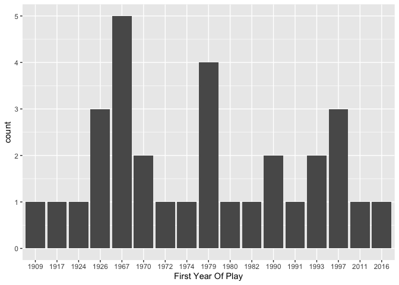
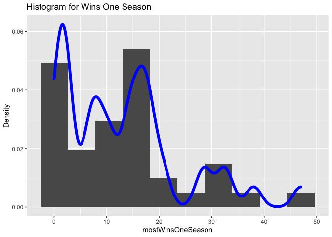
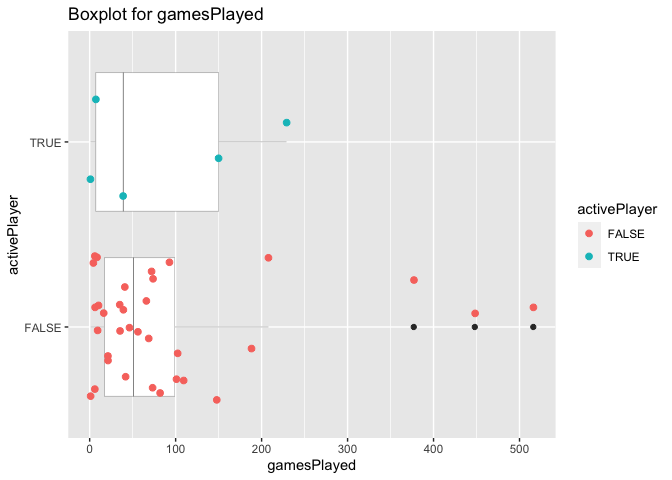
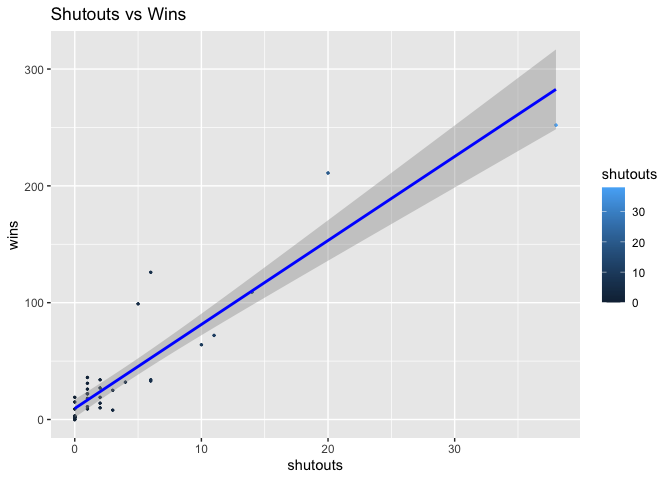
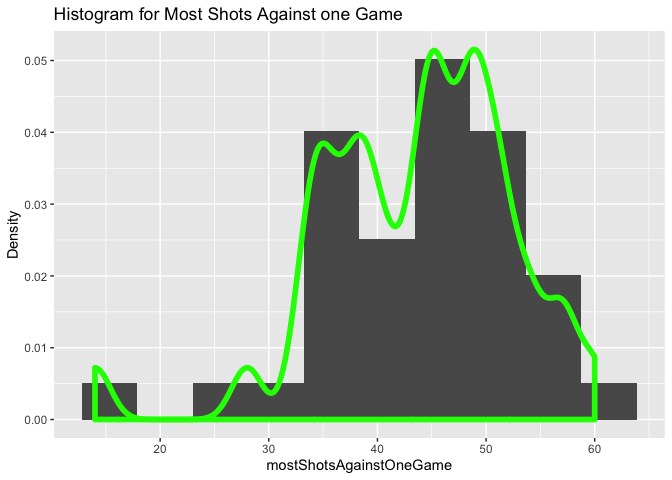

Project1
================

# Required function

``` r
library(httr)
```

    ## Warning: package 'httr' was built under R version 3.6.2

``` r
library(jsonlite)
library(tidyverse)
```

    ## ── Attaching packages ─────────────────────────────────────────────────────────────────────────────────── tidyverse 1.3.0 ──

    ## ✓ ggplot2 3.3.2     ✓ purrr   0.3.4
    ## ✓ tibble  3.0.3     ✓ dplyr   1.0.2
    ## ✓ tidyr   1.1.2     ✓ stringr 1.4.0
    ## ✓ readr   1.3.1     ✓ forcats 0.5.0

    ## Warning: package 'ggplot2' was built under R version 3.6.2

    ## Warning: package 'tibble' was built under R version 3.6.2

    ## Warning: package 'tidyr' was built under R version 3.6.2

    ## Warning: package 'purrr' was built under R version 3.6.2

    ## Warning: package 'dplyr' was built under R version 3.6.2

    ## ── Conflicts ────────────────────────────────────────────────────────────────────────────────────── tidyverse_conflicts() ──
    ## x dplyr::filter()  masks stats::filter()
    ## x purrr::flatten() masks jsonlite::flatten()
    ## x dplyr::lag()     masks stats::lag()

``` r
library(devtools)
```

    ## Warning: package 'devtools' was built under R version 3.6.2

    ## Loading required package: usethis

    ## Warning: package 'usethis' was built under R version 3.6.2

# Records API

``` r
base1<-'https://records.nhl.com/site/api/'
franchise<-function( modifier){
 franchise<-content(GET(paste0(base1,modifier)),'text') 
 franchise<-fromJSON(franchise,flatten=TRUE)
 franchise[[1]]
}

teamTotal<-function(modifier){
 teamTotal<-content(GET(paste0(base1,modifier)),'text') 
 teamTotal<-fromJSON(teamTotal,flatten=TRUE)
 teamTotal[[1]]
}


seasonrd<-function(modifier,franchiseid){
# condition of input a number 
  if(is.numeric(franchiseid)){
   full<-paste0(base1,modifier,'=',franchiseid)
   seasonrd<-content(GET(full),'text')
   seasonrd<-fromJSON(seasonrd,flatten=TRUE)
   seasonrd[[1]]
  }
# condition of input team name: go back to franchiseId data and filter 
 else{
   full<-paste0(base1,modifier)
   seasonrd<-content(GET(full),'text')
   seasonrd<-fromJSON(seasonrd,flatten=TRUE)
   seasonrd<-filter(seasonrd[[1]],franchiseName==franchiseid)
   seasonrd[[1]]
 }
}

goalie<-function(modifier,franchiseid){
  if(is.numeric(franchiseid)){
   full<-paste0(base1,modifier,'=',franchiseid)
   goalie<-content(GET(full),'text')
   goalie<-fromJSON(goalie,flatten=TRUE)
   goalie[[1]]
 }
 else{
   full<-paste0(base1,modifier)
   goalie<-content(GET(full),'text')
   goalie<-fromJSON(goalie,flatten=TRUE)
   goalie<-filter(goalie[[1]],franchiseName==franchiseid)
   goalie[[1]]
 }
}


skater<-function(modifier,franchiseid){
 if(is.numeric(franchiseid)){
   full<-paste0(base1,modifier,'=',franchiseid)
   skater<-content(GET(full),'text')
   skater<-fromJSON(skater,flatten=TRUE)
   skater[[1]]
 }
 else{
   full<-paste0(base1,modifier)
   skater<-content(GET(full),'text')
   skater<-fromJSON(skater,flatten=TRUE)
   skater<-filter(skater[[1]],franchiseName==franchiseid)
   skater[[1]]
 }
}
```

# Stats API

``` r
base<-'https://statsapi.web.nhl.com/api/v1/teams'
stats<-function(modifier,teamID){
 full<-paste0(base,modifier)
  if(modifier=='?expand=team.roster'){
    roster<-content(GET(full),'text')  
    roster<-fromJSON( roster,flatten=TRUE)  
    a<-roster[[2]]
    rowa<-filter(a,id==1)
    b<-a$roster.roster[[1]]
    b$id=c(rep(c(1),nrow(b)))
    dat<-full_join(a,b,by='id')
     for(i in 2:nrow(a)){
      rowa<-a%>%filter(id==i)  
      b<-a$roster.roster[[i]]
      b$id=c(rep(c(i),nrow(b)))
      new<-full_join(rowa,b,by='id')
      dat<-rbind(dat,new)
  }
  return (dat)
}
  else if(modifier=='?expand=person.names'){
    person.names<-content(GET(full),'text')  
    person.names<-fromJSON(person.names,flatten=TRUE) 
    person.names[[2]]
  }
  else if(modifier=='?expand=team.schedule.next'){
    team.schedule.next<-content(GET(full),'text')  
    team.schedule.next<-fromJSON(team.schedule.next,flatten=TRUE) 
    team.schedule.next[[2]]
}
  else if(modifier=='?expand=team.schedule.previous'){
     team.schedule.previous<-content(GET(full),'text')
     team.schedule.previous<-fromJSON(team.schedule.previous,flatten=TRUE)   
     team.schedule.previous[[2]]
    
  }
  else if(modifier=='?expand=team.stats'){
     team.stats<-content(GET(full),'text')
     team.stats<-fromJSON(team.stats,flatten=TRUE)   
     team.stats[[2]]
  }
  else if(modifier=='?expand=team.roster&season='){

    team.roster_season<-content(GET(paste0(full,teamID)),'text')
    team.roster_season<-fromJSON(team.roster_season,flatten=TRUE)   
    team.roster_season[[2]]
  }
  else if(modifier=='?teamId='){
    teamId<-content(GET(paste0(full,teamID)),'text')
    teamId<-fromJSON(teamId,flatten=TRUE)   
    teamId[[2]]
  }
  else if(modifier=='?stats=statsSingleSeasonPlayoffs'){
    statsSingleSeasonPlayoffs<-content(GET(full),'text')
    statsSingleSeasonPlayoffs<-fromJSON(statsSingleSeasonPlayoffs,flatten=TRUE)   
    statsSingleSeasonPlayoffs[[2]]
  }
}
```

# One-stop-shop function

``` r
wrapper<-function(modifier,teamID,franchiseid){
 if(modifier=='franchise'){
   franchise(modifier)
 }
  else if(modifier=='franchise-team-totals'){
   teamTotal(modifier) 
  }
  else if(modifier=='franchise-season-records?cayenneExp=franchiseId'){
   seasonrd(modifier,franchiseid) 
  }
  else if(modifier=='franchise-goalie-records?cayenneExp=franchiseId'){
   goalie(modifier,franchiseid)
    
  }
  else if(modifier=='franchise-skater-records?cayenneExp=franchiseId'){
    skater(modifier,franchiseid)
    
  }
  else {
    stats(modifier,teamID)
  }
}
```

# Qyeary data

## Create new variables

``` r
#combine two data sets
a<- wrapper("franchise-team-totals")
b<- wrapper("?expand=person.names")
combine<-left_join(a,a,by = "franchiseId")
head(combine)
```

    ##   id.x activeFranchise.x firstSeasonId.x franchiseId gameTypeId.x gamesPlayed.x
    ## 1    1                 1        19821983          23            2          2937
    ## 2    1                 1        19821983          23            2          2937
    ## 3    1                 1        19821983          23            2          2937
    ## 4    1                 1        19821983          23            2          2937
    ## 5    1                 1        19821983          23            2          2937
    ## 6    2                 1        19821983          23            3           257
    ##   goalsAgainst.x goalsFor.x homeLosses.x homeOvertimeLosses.x homeTies.x
    ## 1           8708       8647          507                   82         96
    ## 2           8708       8647          507                   82         96
    ## 3           8708       8647          507                   82         96
    ## 4           8708       8647          507                   82         96
    ## 5           8708       8647          507                   82         96
    ## 6            634        697           53                    0         NA
    ##   homeWins.x lastSeasonId.x losses.x overtimeLosses.x penaltyMinutes.x
    ## 1        783             NA     1181              162            44397
    ## 2        783             NA     1181              162            44397
    ## 3        783             NA     1181              162            44397
    ## 4        783             NA     1181              162            44397
    ## 5        783             NA     1181              162            44397
    ## 6         74             NA      120                0             4266
    ##   pointPctg.x points.x roadLosses.x roadOvertimeLosses.x roadTies.x roadWins.x
    ## 1      0.5330     3131          674                   80        123        592
    ## 2      0.5330     3131          674                   80        123        592
    ## 3      0.5330     3131          674                   80        123        592
    ## 4      0.5330     3131          674                   80        123        592
    ## 5      0.5330     3131          674                   80        123        592
    ## 6      0.0039        2           67                    0         NA         63
    ##   shootoutLosses.x shootoutWins.x shutouts.x teamId.x        teamName.x ties.x
    ## 1               79             78        193        1 New Jersey Devils    219
    ## 2               79             78        193        1 New Jersey Devils    219
    ## 3               79             78        193        1 New Jersey Devils    219
    ## 4               79             78        193        1 New Jersey Devils    219
    ## 5               79             78        193        1 New Jersey Devils    219
    ## 6                0              0         25        1 New Jersey Devils     NA
    ##   triCode.x wins.x id.y activeFranchise.y firstSeasonId.y gameTypeId.y
    ## 1       NJD   1375    1                 1        19821983            2
    ## 2       NJD   1375    2                 1        19821983            3
    ## 3       NJD   1375   69                 1        19761977            2
    ## 4       NJD   1375   70                 1        19761977            3
    ## 5       NJD   1375   90                 1        19741975            2
    ## 6       NJD    137    1                 1        19821983            2
    ##   gamesPlayed.y goalsAgainst.y goalsFor.y homeLosses.y homeOvertimeLosses.y
    ## 1          2937           8708       8647          507                   82
    ## 2           257            634        697           53                    0
    ## 3           480           1957       1426          115                   NA
    ## 4             2              6          3            1                   NA
    ## 5           160            679        374           44                   NA
    ## 6          2937           8708       8647          507                   82
    ##   homeTies.y homeWins.y lastSeasonId.y losses.y overtimeLosses.y
    ## 1         96        783             NA     1181              162
    ## 2         NA         74             NA      120                0
    ## 3         47         78       19811982      281               NA
    ## 4         NA          0       19811982        2               NA
    ## 5         16         20       19751976      110               NA
    ## 6         96        783             NA     1181              162
    ##   penaltyMinutes.y pointPctg.y points.y roadLosses.y roadOvertimeLosses.y
    ## 1            44397      0.5330     3131          674                   80
    ## 2             4266      0.0039        2           67                    0
    ## 3             6216      0.3250      312          166                   NA
    ## 4               25      0.0000        0            1                   NA
    ## 5             1726      0.2406       77           66                   NA
    ## 6            44397      0.5330     3131          674                   80
    ##   roadTies.y roadWins.y shootoutLosses.y shootoutWins.y shutouts.y teamId.y
    ## 1        123        592               79             78        193        1
    ## 2         NA         63                0              0         25        1
    ## 3         39         35                0              0          3       35
    ## 4         NA          0                0              0          0       35
    ## 5          7          7                0              0          0       48
    ## 6        123        592               79             78        193        1
    ##           teamName.y ties.y triCode.y wins.y
    ## 1  New Jersey Devils    219       NJD   1375
    ## 2  New Jersey Devils     NA       NJD    137
    ## 3   Colorado Rockies     86       CLR    113
    ## 4   Colorado Rockies     NA       CLR      0
    ## 5 Kansas City Scouts     23       KCS     27
    ## 6  New Jersey Devils    219       NJD   1375

``` r
# create new variables
combine$homelosspercent<-combine$homeLosses.x/100
combine$roadLosses.x<-combine$roadLosses.x/100
```

## Contingency Tables

``` r
#contigency table
data5 <-wrapper('?expand=team.roster&season=', teamID= "20122013")
table(data5$active,data5$venue.name)%>% knitr::kable(caption = "Active and venue.name")
```

|       | AMALIE Arena | American Airlines Center | Barclays Center | BB\&T Center | Bell Centre | Bell MTS Place | Bridgestone Arena | Canadian Tire Centre | Capital One Arena | Enterprise Center | Honda Center | Jobing.com Arena | KeyBank Center | Little Caesars Arena | Madison Square Garden | Nationwide Arena | Pepsi Center | PNC Arena | PPG Paints Arena | Prudential Center | Rogers Arena | Rogers Place | SAP Center at San Jose | Scotiabank Arena | Scotiabank Saddledome | STAPLES Center | TD Garden | United Center | Wells Fargo Center | Xcel Energy Center |
| :---- | -----------: | -----------------------: | --------------: | -----------: | ----------: | -------------: | ----------------: | -------------------: | ----------------: | ----------------: | -----------: | ---------------: | -------------: | -------------------: | --------------------: | ---------------: | -----------: | --------: | ---------------: | ----------------: | -----------: | -----------: | ---------------------: | ---------------: | --------------------: | -------------: | --------: | ------------: | -----------------: | -----------------: |
| FALSE |            0 |                        0 |               0 |            0 |           0 |              0 |                 0 |                    0 |                 0 |                 0 |            0 |                1 |              0 |                    0 |                     0 |                0 |            0 |         0 |                0 |                 0 |            0 |            0 |                      0 |                0 |                     0 |              0 |         0 |             0 |                  0 |                  0 |
| TRUE  |            1 |                        1 |               1 |            1 |           1 |              1 |                 1 |                    1 |                 1 |                 1 |            1 |                0 |              1 |                    1 |                     1 |                1 |            1 |         1 |                1 |                 1 |            1 |            1 |                      1 |                1 |                     1 |              1 |         1 |             1 |                  1 |                  1 |

Active and venue.name

``` r
data<-wrapper('franchise-team-totals')
table(data$gameTypeId,data$teamName)%>% knitr::kable(caption = "Type Id and games played")
```

|   | Anaheim Ducks | Arizona Coyotes | Atlanta Flames | Atlanta Thrashers | Boston Bruins | Brooklyn Americans | Buffalo Sabres | Calgary Flames | California Golden Seals | Carolina Hurricanes | Chicago Blackhawks | Cleveland Barons | Colorado Avalanche | Colorado Rockies | Columbus Blue Jackets | Dallas Stars | Detroit Cougars | Detroit Falcons | Detroit Red Wings | Edmonton Oilers | Florida Panthers | Hamilton Tigers | Hartford Whalers | Kansas City Scouts | Los Angeles Kings | Minnesota North Stars | Minnesota Wild | Montréal Canadiens | Montreal Maroons | Montreal Wanderers | Nashville Predators | New Jersey Devils | New York Americans | New York Islanders | New York Rangers | Oakland Seals | Ottawa Senators | Ottawa Senators (1917) | Philadelphia Flyers | Philadelphia Quakers | Phoenix Coyotes | Pittsburgh Penguins | Pittsburgh Pirates | Quebec Bulldogs | Quebec Nordiques | San Jose Sharks | St. Louis Blues | St. Louis Eagles | Tampa Bay Lightning | Toronto Arenas | Toronto Maple Leafs | Toronto St. Patricks | Vancouver Canucks | Vegas Golden Knights | Washington Capitals | Winnipeg Jets | Winnipeg Jets (1979) |
| :- | ------------: | --------------: | -------------: | ----------------: | ------------: | -----------------: | -------------: | -------------: | ----------------------: | ------------------: | -----------------: | ---------------: | -----------------: | ---------------: | --------------------: | -----------: | --------------: | --------------: | ----------------: | --------------: | ---------------: | --------------: | ---------------: | -----------------: | ----------------: | --------------------: | -------------: | -----------------: | ---------------: | -----------------: | ------------------: | ----------------: | -----------------: | -----------------: | ---------------: | ------------: | --------------: | ---------------------: | ------------------: | -------------------: | --------------: | ------------------: | -----------------: | --------------: | ---------------: | --------------: | --------------: | ---------------: | ------------------: | -------------: | ------------------: | -------------------: | ----------------: | -------------------: | ------------------: | ------------: | -------------------: |
| 2 |             1 |               1 |              1 |                 1 |             1 |                  1 |              1 |              1 |                       1 |                   1 |                  1 |                1 |                  1 |                1 |                     1 |            1 |               1 |               1 |                 1 |               1 |                1 |               1 |                1 |                  1 |                 1 |                     1 |              1 |                  1 |                1 |                  1 |                   1 |                 1 |                  1 |                  1 |                1 |             1 |               1 |                      1 |                   1 |                    1 |               1 |                   1 |                  1 |               1 |                1 |               1 |               1 |                1 |                   1 |              1 |                   1 |                    1 |                 1 |                    1 |                   1 |             1 |                    1 |
| 3 |             1 |               1 |              1 |                 1 |             1 |                  0 |              1 |              1 |                       0 |                   1 |                  1 |                0 |                  1 |                1 |                     1 |            1 |               1 |               1 |                 1 |               1 |                1 |               0 |                1 |                  0 |                 1 |                     1 |              1 |                  1 |                1 |                  0 |                   1 |                 1 |                  1 |                  1 |                1 |             1 |               1 |                      1 |                   1 |                    0 |               1 |                   1 |                  1 |               0 |                1 |               1 |               1 |                0 |                   1 |              1 |                   1 |                    1 |                 1 |                    1 |                   1 |             1 |                    1 |

Type Id and games played

## Numerical Summaries

``` r
newData1<-wrapper(modifier = 'franchise-goalie-records?cayenneExp=franchiseId', franchiseid  = 20)
newData1 %>% group_by(activePlayer) %>% summarise(avg = mean(gamesPlayed), med = median(gamesPlayed), var = var(gamesPlayed), IQR = IQR(gamesPlayed)) %>%knitr::kable(caption = "Numeric summaries for games palyed")
```

| activePlayer |      avg | med |      var |    IQR |
| :----------- | -------: | --: | -------: | -----: |
| FALSE        | 92.02941 |  51 | 15418.15 |  81.75 |
| TRUE         | 85.20000 |  39 | 10054.20 | 143.00 |

Numeric summaries for games palyed

``` r
newData1 %>% group_by(activePlayer) %>% summarise(avg = mean(mostWinsOneSeason), med = median(mostWinsOneSeason), var = var(mostWinsOneSeason), IQR = IQR(mostWinsOneSeason)) %>%knitr::kable(caption = "Numeric summaries for most wins")
```

| activePlayer |      avg |  med |     var | IQR |
| :----------- | -------: | ---: | ------: | --: |
| FALSE        | 13.29412 | 12.5 | 125.426 |  14 |
| TRUE         | 13.20000 |  7.0 | 201.700 |  26 |

Numeric summaries for most wins

## Plots

### (1) Bar Plot

``` r
data6<- wrapper( modifier = "?expand=team.stats")
g1 <- ggplot(data = data6, aes(x=firstYearOfPlay))
g1 + geom_bar() + labs(x = "First Year Of Play")
```

<!-- -->

### (2) Histogram

``` r
g2<-ggplot(newData1,aes(x=mostWinsOneSeason, y =..density..))
g2+geom_histogram(bins = 10)+geom_density(adjust = 0.3,color="blue",lwd=2)+labs(y="Density",title = "Histogram for Wins One Season")
```

<!-- -->

### (3) Box Plot

``` r
g3<- ggplot(newData1,aes(x=gamesPlayed,y= activePlayer))
g3+geom_boxplot(size=0.1)+geom_point(position = "jitter",aes(group = activePlayer, col= activePlayer),size=2)+labs(title = "Boxplot for gamesPlayed")
```

<!-- -->

### (4) Scatter Plot

``` r
g4<-ggplot(newData1,aes(group=gameTypeId,x = shutouts, y = wins))
g4+geom_point(aes(color=shutouts),size=0.5)+geom_smooth(method = lm,color = "blue")+labs(title = "Shutouts vs Wins") 
```

<!-- -->

### (5) Histogram

``` r
g2<-ggplot(newData1,aes(x=mostShotsAgainstOneGame, y =..density..))
g2+geom_histogram(bins = 10)+geom_density(adjust = 0.4,color="green",lwd=2,outline.type = "full")+labs(y="Density",title = "Histogram for Most Shots Against one Game")
```

<!-- -->
